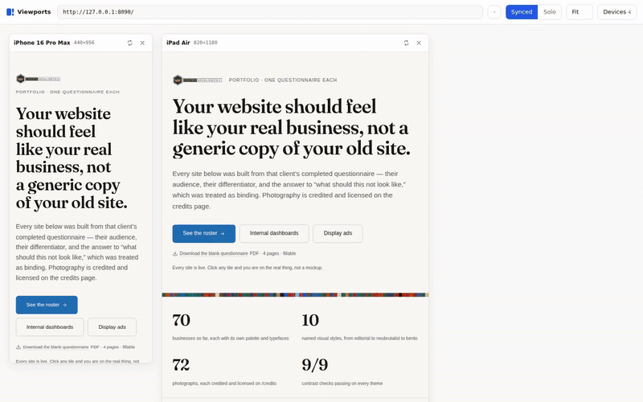
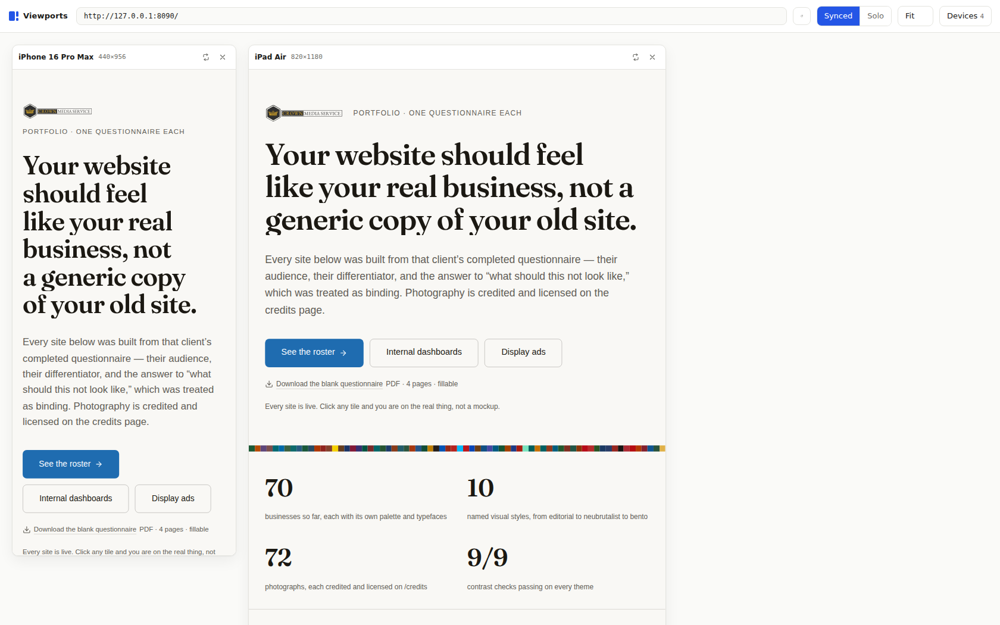
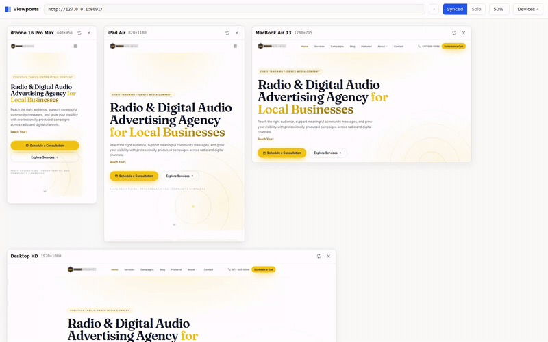
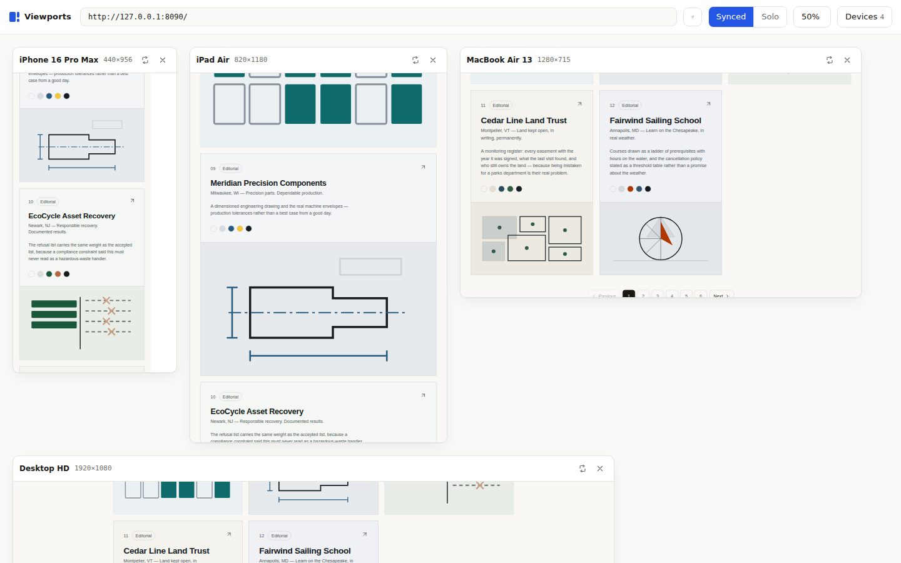
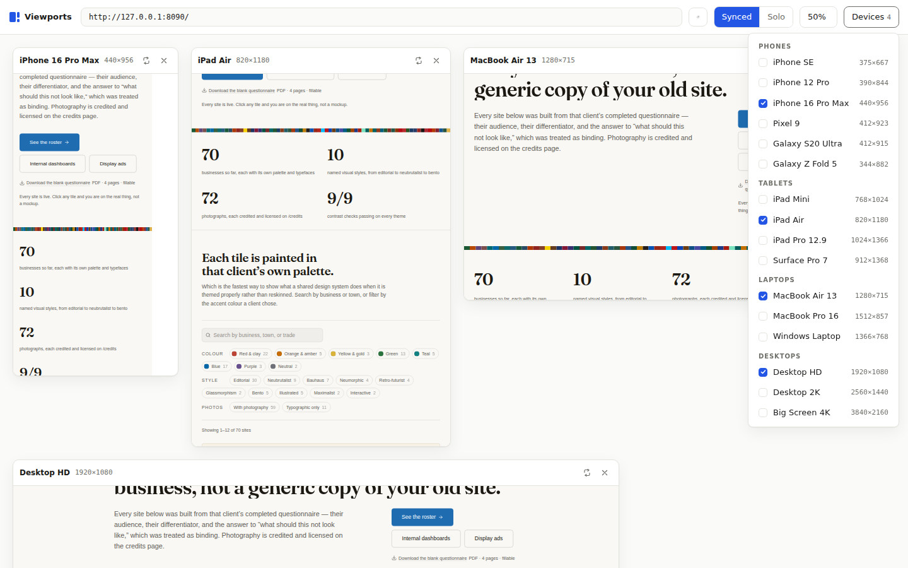
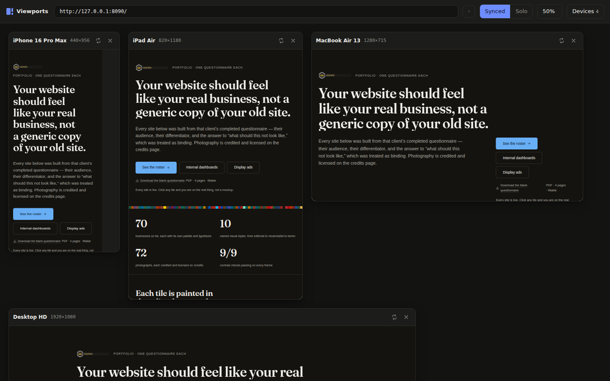

# Viewports — Multi-Device Preview

**See your site on every device at once.** A deliberately lightweight Chrome
extension for developers: open any page in a grid of live device viewports —
phones, tablets, laptops, desktops, big screens — side by side in one tab,
and scroll them together or individually.

No frameworks. No build step. No dependencies. Six small files of vanilla
JS/CSS, MIT licensed.



## Why

Chrome DevTools device mode shows one device at a time. Commercial tools that
show many are heavyweight Electron apps. This is the middle path: every
device you care about, live, in a normal browser tab, from an extension small
enough to read in one sitting.

## Features

- **One click** — press the toolbar icon on any page and it opens in the grid.
- **Real viewports** — each device is a genuine `<iframe>` at its true CSS
  viewport size, scaled down with a CSS transform. Media queries, container
  queries and responsive layouts behave exactly as they do on the device.
- **Synced & Solo scrolling** — scroll one viewport and the rest follow
  (positions are relayed as *ratios*, so pages of different heights stay
  aligned), or switch to Solo and drive each viewport independently.
- **Synced interactions** — in Synced mode, clicks and typing mirror too:
  click "About" in one viewport and every device navigates there; type into
  a form field and the same text appears in all of them. Elements are
  matched by *identity* (id → link href → text → structure), never by
  coordinates, so it works even when the target lives in a hamburger menu
  on mobile. Checkboxes, radios and selects mirror as well.
- **40 built-in devices** — from the 280px Galaxy Fold and 320px iPhone SE
  right up to 4K and 21:9 ultrawide, in five groups: Phones (iPhone SE 1st
  gen → 16 Pro Max, Pixel, Galaxy, foldables), Tablets (iPad Mini/10.2/Air/
  Pro 11 & 12.9, Surface, Nexus 7), Laptops (MacBook Air 13/15, MacBook Pro
  16, Windows, Chromebook), Desktops (HD, 2K, ultrawide, 4K) and **Legacy
  screens** (SVGA 800×600, XGA 1024×768, SXGA 1280×1024, netbook). Type in
  the picker's filter box to find one by name or size.
- **Drag to rearrange** — grab any card by its header and drop it wherever
  you want it in the grid.
- **Rotate & hide** per device; **uniform zoom** with a Fit mode that keeps
  relative device sizes honest; URL bar and reload-all.
- **Remembers your setup** — device selection, card order, zoom, and scroll
  mode persist.
- **Dual-theme UI** — the viewer follows your system light/dark preference.

## Screenshots

*A production site across iPhone, iPad, MacBook and Desktop HD — one tab, one glance:*



*Drag any card by its header to rearrange the grid however you like (shown at 50% zoom):*



*Synced scrolling — every viewport at the same proportional position, however tall its page is:*



*The device picker, grouped by category:*



*The viewer follows your system theme — and so does the page, if it supports dark mode:*



## Install

Until it's on the Chrome Web Store, load it as an unpacked extension:

1. Clone this repository:
   ```sh
   git clone https://github.com/lewisjohnvillamor/Browser-Viewport.git
   ```
2. Open `chrome://extensions` in Chrome (or any Chromium-based browser —
   Edge, Brave, Arc, Opera).
3. Turn on **Developer mode** (top right).
4. Click **Load unpacked** and select the cloned folder.
5. Visit any page and click the **Viewports** toolbar icon.

## Usage

| Control | What it does |
|---|---|
| Toolbar icon | Opens the current page in the multi-viewport grid |
| URL bar | Preview any URL — type it and press Enter |
| **Synced** / **Solo** | Scroll all viewports together, or each on its own |
| Zoom | `Fit` scales so the widest enabled device fits your window; or 25–100% |
| **Devices** | Enable/disable devices, grouped by phones / tablets / laptops / desktops |
| Drag a card's header | Move that viewport anywhere in the grid |
| ⟳ on a card | Rotate that device to landscape |
| ✕ on a card | Hide that device |

### Adding your own device

Every device is one line in [`devices.js`](devices.js):

```js
{ id: "framework-13", name: "Framework 13", w: 1256, h: 786 },
```

Add it to the group it belongs to, reload the extension, done.

## How it works

Six files, one job each:

| File | Role |
|---|---|
| `manifest.json` | Manifest V3 definition |
| `background.js` | Service worker: opens the viewer, manages header-stripping rules |
| `viewer.html/css/js` | The grid UI: cards, device picker, zoom, scroll-mode relay |
| `sync.js` | Content script that mirrors scroll positions between frames |
| `devices.js` | The device catalog |

Two pieces deserve explanation:

**Framing sites that forbid iframes.** Many sites send `X-Frame-Options` or a
CSP that blocks embedding. The extension registers a `declarativeNetRequest`
**session rule scoped to the viewer's tab and to sub-frame requests only**
that strips those headers. Your normal browsing is never touched — the rule
matches nothing outside the viewer tab and is deleted when the tab closes.

**Scroll sync without bloat.** `sync.js` is injected everywhere (that's how
content scripts work) but immediately exits unless the frame's *direct parent
is this extension's viewer page*, verified via `location.ancestorOrigins`. On
real pages it's a few no-op lines. Inside the viewer, each frame reports its
scroll position as a ratio of its scrollable height; the viewer relays it to
the other frames, which apply it — with an echo guard so frames never loop.

**Interaction sync that can't loop.** Only *trusted* events (real user input,
`event.isTrusted`) are broadcast; everything a sibling frame applies is
synthetic, so an applied click or keystroke can never re-broadcast. Clicks
are mirrored by element identity — id, then link `href`, then visible text,
then structural position — because coordinates mean nothing across
breakpoints. Mirrored input uses the native value setter plus an `input`
event, so controlled inputs in React/Vue apps update correctly.

## Known limitations

- Extensions can't fake the user agent or touch events per-iframe, so sites
  that UA-sniff may serve their desktop markup everywhere. Responsive CSS,
  media queries, and viewport-based layout all behave correctly.
- Iframes are a third-party context: sites with strict cookie policies may
  treat you as logged out inside the grid.
- Pages using JavaScript frame-busting (rare today) may refuse to render.
- Only the main document scroll is synced — nested scrollable panels scroll
  independently by design.
- Interaction sync is best-effort: for links there is a safety net — if a
  breakpoint never renders the clicked link at all (some frameworks only
  mount menu items while the menu is open), that viewport falls back to
  navigating to the link's URL directly. Non-link elements without a match,
  and heavily custom widgets (canvas UIs, shadow-DOM components), may not
  mirror. Remember every viewport is a real page — a mirrored form submit
  submits in every viewport.

## Support

If this tool saves you some squinting between devices, you can
[**buy me a coffee** ☕](https://www.paypal.com/paypalme/lewisjohnvillamor/250) —
much appreciated, never expected.

## Contributing

Issues and pull requests are welcome. The bar for adding code is
intentionally high: this project values staying small enough to audit in
minutes. Good contributions include new device presets, bug fixes, and
accessibility improvements. Dependencies, build steps, and frameworks will be
politely declined.

## License

[MIT](LICENSE) © Lewis John Villamor and contributors.
